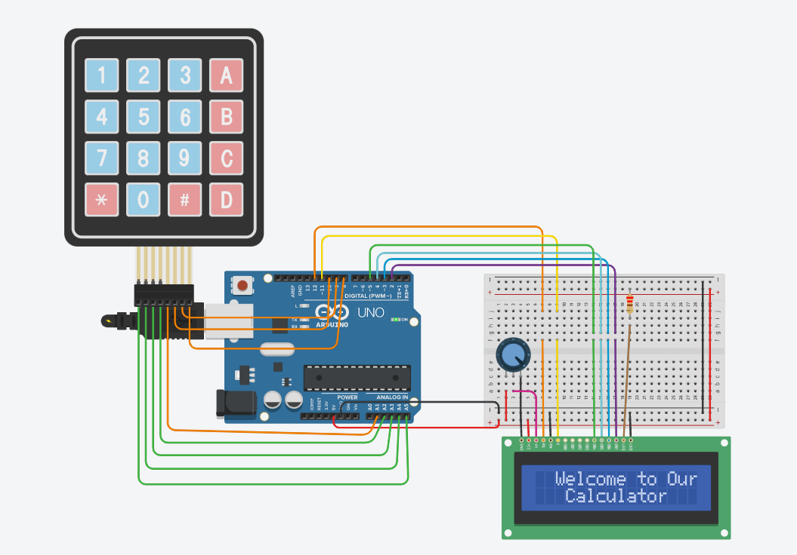

# Simple-Calculator

A simple Calculator for general purposes.

## Why use it?

Its useful for simple calculations.

## Features

* Add
* Multiply
* Subtract
* Divide

## Built With

* C
* C++

## Components

* Arduino Uno R3
* Keypad 4x4
* Lcd 16x2
* 250 kΩ Potentiometer

